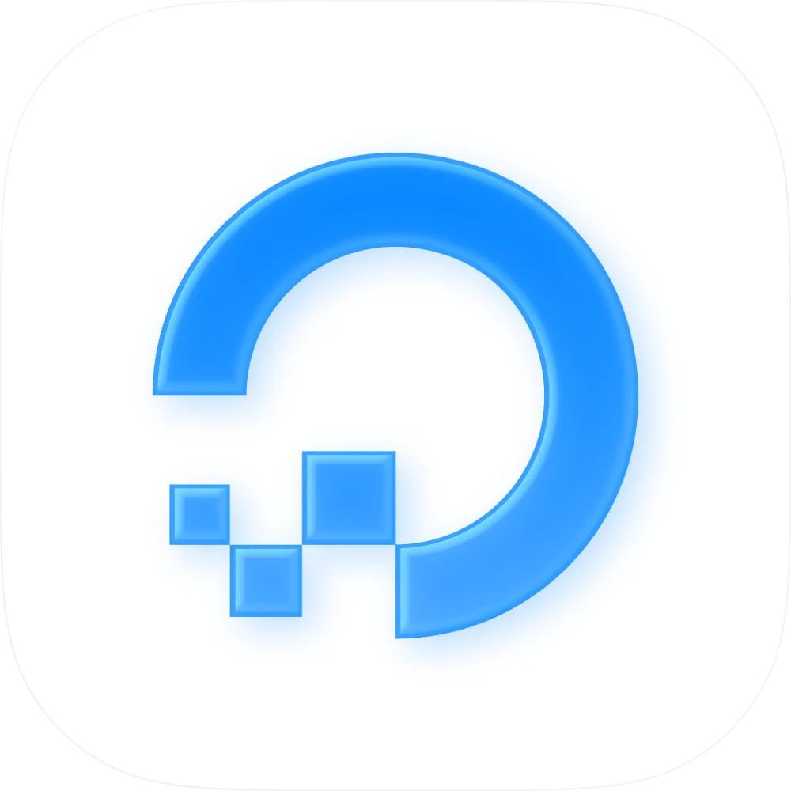

# Ocean

### Manage your DigitalOcean infrastructure on the go.

## Features

### DROPLETS
- Create, resize, and destroy droplets
- Power on/off and reboot
- Access console and metrics
- Manage snapshots and backups

### DATABASES
- Manage PostgreSQL, MySQL, Redis clusters
- View connection details
- Monitor database metrics

### SPACES
- Browse and manage object storage
- Upload and download files
- Manage bucket policies

### NETWORKING
- Manage domains and DNS records
- Load balancers and firewalls
- VPC configuration

### APP PLATFORM
- Deploy and manage apps
- View deployment logs
- Scale app resources

## Environment
- macOS 14+ (Sonoma)
- Node v24
- Npm v10.9 (please don't commit a `yarn.lock` file, we are using `npm` both for development and building)
- Xcode 26

## Contributing
Welcome, anon. We've been expecting you.

Feel free to open an issue or submit a pull request.

🎁 **Merged PRs receive a Lifetime License!**

## Message for humans

#### Do you work at the company this app is made for?
There's a big chance I'm already in touch with one of your colleagues, but feel free to message me and discuss anything. I'd love to chat with like minded people! 

#### Do you want to build the same kind of apps?
If you're looking to get into mobile apps, need advice and want to partner then you can message me. You need a decent amount of coding knowledge, if you started vibecoding last year give yourself a bit more time. No contact details but I trust you'll find a way to message me :)